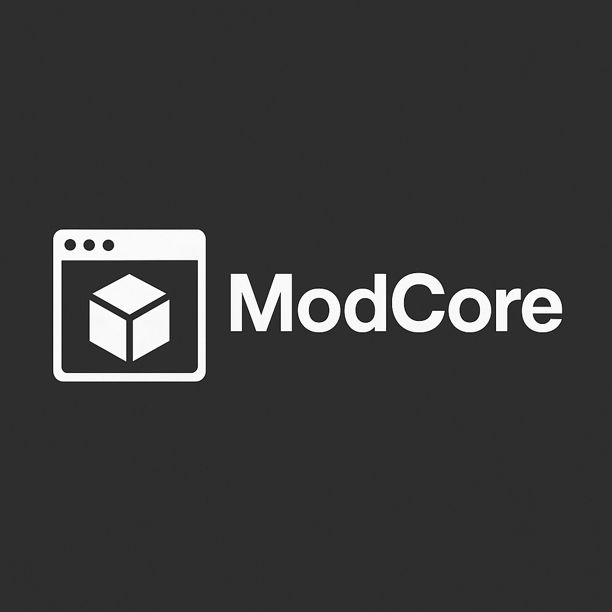

# ModCore
What ModCore Is – A short pitch (“A Unity modding framework with dual compiler support for easy mod creation.

# ModCore Installation

Drag and drop the .unitypackage file directly into Unity. Some other installations intructions, docs and other things are also included in the package. Enjoy!

# Regarding Security and Viruses

I promise you that there are absolutely no viruses, malwares, or any other kind of malicious software hidden inside the file. If you are worried,
you can visit this website https://unitypackage-viewer.mizle.net/ and then upload the .unitypackage file to verify yourself.
